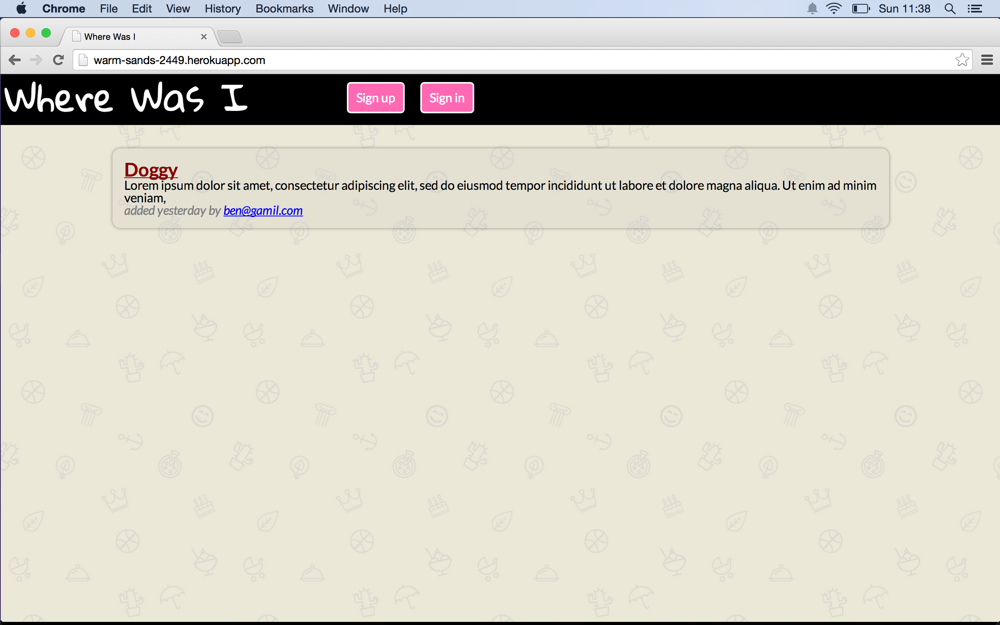

Where was I
===========


A simple bookmark manager written in in ruby. A first introduction to databases using datamapper and postgres. Also took my first steps in intergration testing using cucumber.

####The app involved using many new concepts and skills including:

> *	 persisting users and bookmarks in the database.
> *  One to many relationships between users and bookmars. 
> *  Many to many relationships tags.  
> *  User authentication and tracking with Bcrypt and sessions


[Click here](http://warm-sands-2449.herokuapp.com/) to check it out online




Skills learnt/used
-----------------
> * ruby  
> * rspec
> * datamapper
> * postgress
> * ruby  
> * rspec
> * capybara
> * cucumber


How to use
----------

Clone the repository:

```shell 
$ git clone git@github.com:benjamintillett/wherewasi.git

```
Run the test

```shell 
$ cd wherewasi
$ rspec
```


